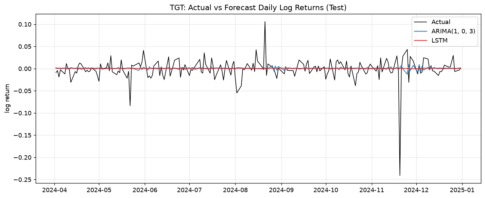

# Financial Analytics Portfolio — Golam Rahat
<!-- EDIT: replace the name above with yours if different -->

> BBA student majoring in **Business Analytics** at United International University — building **reproducible** Python analytics for **financial risk and return forecasting**.


🔗 **[LinkedIn](https://www.linkedin.com/in/golamrahat78)** &nbsp;·&nbsp; **[Live portfolio](#)** &nbsp;·&nbsp; **[golamrahat111@gmail.com](mailto:golamrahat111@gmail.com)**
<!-- EDIT: add your GitHub Pages "Live portfolio" URL once published -->

---

## About

I am a BBA student majoring in Business Analytics at United International University, developing
applied skills in financial analytics, Python-based data handling, and time-series modeling. This
portfolio moves through the full workflow of a junior
quantitative analyst: assembling a clean, analytics-ready dataset; forecasting market-risk
conditions with GARCH; and comparing classical and deep-learning models for stock-return
forecasting.

I care about **reproducible workflows** — fixed data periods, documented sources, no-leakage
validation, and honest model selection — so analysis can be re-run and defended, not just produced.

## Skills

`Python` · `pandas` · `NumPy` · `Jupyter` · `Data cleaning` · `Visualization` ·
`Return calculation` · `GARCH volatility modeling` · `ARIMA` · `LSTM` · `Model evaluation` ·
`statsmodels` · `TensorFlow / Keras` · `scikit-learn` · `Financial memo writing` ·
`GitHub` · `Responsible AI use`

---

## Projects

### 1 · Analytics-ready dataset *(dataset engineering)*

Built a monthly analytics-ready dataset for **Target Corporation (TGT)**
<!-- EDIT: if your Project 1 used a Bangladeshi listed company, change the name here -->
by combining stock-price data, annual firm-level variables, and macroeconomic indicators into a
single aligned table, with documented sources, a data dictionary, and quality checks.

- **Sources:** stock prices · firm financials · macroeconomic indicators
- **Alignment rule:** aligned to a common monthly frequency <!-- EDIT: state your exact rule -->
- **Quality checks:** missing-value handling and range validation

### 2 · GARCH(1,1) volatility forecast *(market risk)*

Estimated a fat-tailed **GARCH(1,1)–Student's t** model on TGT daily log returns to capture
volatility clustering, produced a short-horizon conditional-volatility outlook, and wrote an
investment-risk memo for a committee audience.

> **Key finding:** TGT shows strong volatility persistence (α₁ + β₁ ≈ **0.84**, shock half-life
> ≈ **4 days**). The 5-day outlook projects daily conditional volatility rising from **~1.74%**
> to **~1.95%** (≈ 28%–30% annualized).


*GARCH(1,1) conditional volatility, last 252 days + 5-day outlook.*

### 3 · ARIMA vs. LSTM return forecasting *(forecasting)*

Compared a classical **ARIMA** benchmark against a deep-learning **LSTM** for forecasting TGT daily
log returns, using a chronological train/validation/test split (879 / 188 / 190 days) with no
leakage and a like-for-like evaluation on the same held-out test window.

| Model | Forecast target | Test MAE | Test RMSE | Directional accuracy |
|---|---|---:|---:|---:|
| **ARIMA(1,0,3)** ✅ | Daily log return | 0.0145 | 0.0257 | 54.7% |
| LSTM (10→50→1) | Daily log return | 0.0144 | 0.0254 | 45.8% |


*Actual vs. ARIMA/LSTM forecast daily log returns over the test window.*

**Selected model: ARIMA(1,0,3).** The LSTM's RMSE was lower by only ~1.2% (below the materiality
threshold) and its directional accuracy was actually *worse*, so the decision rule favored the
simpler, faster, more explainable benchmark.

> **Caveat:** daily-return forecasts are dominated by noise. Directional accuracy near 50% is
> normal and does not imply a profitable strategy after transaction costs — these forecasts inform
> positioning, they are not standalone trading signals.

**Evidence:**
[Notebook](notebooks/project3_arima_lstm_return_forecasting.ipynb) ·
[Forecasting memo](memos/project3_forecasting_memo.docx) ·
[Interactive dashboard](outputs/plots/interactive_forecast_dashboard.html) ·
[Comparison table](outputs/model_comparison_table.csv)

---

## Repository structure

```
project_3_team_hemisphere/
├── notebooks/      project3_arima_lstm_return_forecasting.ipynb
├── final_data/     TGT_forecast_ready.csv  (date, price, log return, split)
├── outputs/        model_comparison_table.csv, 30_day_return_forecast.csv, plots/
├── memos/          project3_forecasting_memo
├── ai_appendix/    project3_ai_audit_log
└── references/     source_log.csv, package_versions.txt
```

## AI disclosure

These projects were completed with assistance from **Claude (Anthropic)**
<!-- EDIT: add any other AI tools you used -->
for code drafting, debugging, environment setup, and document preparation. Every AI-generated
output was reviewed, executed, and independently verified before use. All quantitative results
shown here come from my own runs on the real data — not from text generated by an AI — and I can
explain each method and result in a viva-style discussion.

## Contact

Open to entry-level financial-analytics and quantitative-research opportunities.
**[LinkedIn](https://www.linkedin.com/in/golamrahat78)** · **[golamrahat111@gmail.com](mailto:golamrahat111@gmail.com)**
